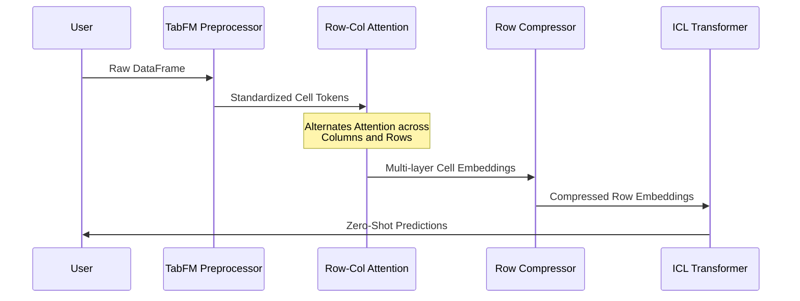
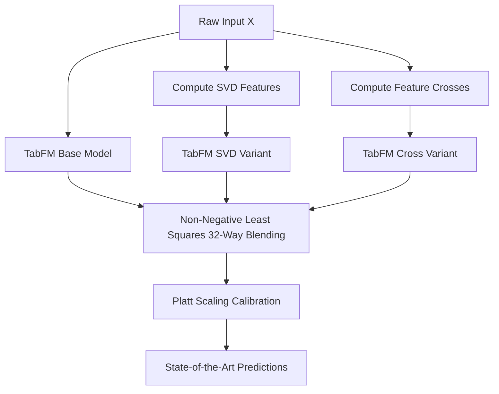

# Hands-On Guide to Google's TabFM: How It Works, Code Setup, Fixes & Advanced Fine-Tuning

In our previous post, we explored the theoretical shift introduced by **Google Research's TabFM**—a zero-shot foundation model for tabular classification and regression.

Now, let's roll up our sleeves and get practical. 

In this developer guide, we will walk through:
1. How to install and set up TabFM in Python.
2. How to run zero-shot predictions using the Scikit-Learn-compatible API.
3. What happens under the hood during execution.
4. How to troubleshoot and fix real-world limitations (memory constraints, >10 classes, high-cardinality features).
5. How to build **TabFM-Ensemble** and fine-tune performance when default zero-shot inference isn't enough.

---

## 1. Installation & Environment Setup

The TabFM codebase is open-sourced on GitHub under Apache 2.0 (`google-research/tabfm`), while pre-trained model weights are hosted on Hugging Face (`google/tabfm-1.0.0-pytorch`).

> **Pro-Tip / Fix:** Avoid installing from PyPI directly, as PyPI packages can encounter weight-loading issues. Always install directly from Google's official GitHub repository:

```bash
# Install TabFM directly from GitHub
pip install git+https://github.com/google-research/tabfm.git

# Core dependencies
pip install torch transformers scikit-learn pandas numpy
```

---

## 2. Basic Zero-Shot Inference (Scikit-Learn API)

TabFM provides a wrapper that mirrors standard Scikit-Learn estimators (`TabFMClassifier` and `TabFMRegressor`). 

Here is a complete working example for binary classification:

```python
import pandas as pd
from sklearn.model_selection import train_test_split
from sklearn.metrics import roc_auc_score
from tabfm import TabFMClassifier

# 1. Load your tabular dataset (mixed numerical & categorical columns)
df = pd.read_csv("customer_churn.csv")
X = df.drop(columns=["churn_label"])
y = df["churn_label"]

X_train, X_test, y_train, y_test = train_test_split(
    X, y, test_size=0.2, random_state=42
)

# 2. Initialize TabFM Classifier
# Downloads pre-trained weights from 'google/tabfm-1.0.0-pytorch'
model = TabFMClassifier(
    device="cuda",  # or "cpu" / "mps" for Mac Apple Silicon
    batch_size=32
)

# 3. Store Context (No Gradient Training Happens Here!)
model.fit(X_train, y_train)

# 4. Zero-Shot In-Context Prediction
y_pred_proba = model.predict_proba(X_test)[:, 1]

# 5. Evaluate Performance
auc = roc_auc_score(y_test, y_pred_proba)
print(f"TabFM Zero-Shot ROC-AUC: {auc:.4f}")
```

### What is `.fit()` actually doing?
In traditional XGBoost, `.fit()` runs thousands of iterations of tree splitting and gradient updating. 

In TabFM, **`.fit()` does zero parameter updating**. It simply preprocesses your training set and formats `X_train` and `y_train` into an **in-context memory buffer**. The actual intelligence happens during `.predict()`, where `X_test` is passed alongside `X_train` in a single forward pass.

---

## 3. How TabFM Works Under the Hood

To understand how to troubleshoot TabFM, we need to trace how data flows through its internal pipeline:



1. **Preprocessing:** TabFM converts mixed column types (continuous numbers, strings, categories) into standardized numerical tokens.
2. **Alternating Attention:** The model passes tokens through alternating column attention (learning feature interactions like `Age × Income`) and row attention (learning sample similarities).
3. **Row Embedding:** The entire multi-column state of a row is compressed into a single vector representation.
4. **ICL Transformer:** Attention is computed over row vectors to predict test row labels.

---

## 4. Troubleshooting & Fixing Real-World Edge Cases

While zero-shot tabular learning sounds like magic, real-world enterprise tables hit specific constraints. Here is how to fix them:

### Issue 1: Out of Memory (OOM) on Large Datasets (100k+ Rows)
* **Problem:** Because TabFM passes training rows as in-context memory, passing 100,000+ training rows into GPU memory will cause Out of Memory (OOM) errors.
* **Fix:** Use **Stratified Subsampling** or **k-NN Context Retrieval**. Instead of passing the whole dataset as context, retrieve the top $N$ (e.g., $N=1,000$) training samples most relevant to the test set:

```python
from sklearn.neighbors import NearestNeighbors
import numpy as np

def predict_with_knn_context(model, X_train, y_train, X_test, k_context=1000):
    """Subsample context for huge datasets to prevent GPU OOM."""
    nn = NearestNeighbors(n_neighbors=k_context, metric="euclidean")
    
    # Preprocess numerical features for distance search
    X_train_num = X_train.select_dtypes(include=[np.number]).fillna(0)
    X_test_num = X_test.select_dtypes(include=[np.number]).fillna(0)
    
    nn.fit(X_train_num)
    indices = nn.kneighbors(X_test_num, return_distance=False)
    
    predictions = []
    for i, test_row in enumerate(X_test.iloc):
        # Retrieve local context for this specific test row
        context_idx = indices[i]
        X_ctx = X_train.iloc[context_idx]
        y_ctx = y_train.iloc[context_idx]
        
        # Fit local context and predict
        model.fit(X_ctx, y_ctx)
        pred = model.predict_proba(X_test.iloc[[i]])
        predictions.append(pred[0])
        
    return np.array(predictions)
```

---

### Issue 2: Classification Tasks with > 10 Classes
* **Problem:** Out-of-the-box TabFM weights support up to **10 distinct target classes**. Passing a dataset with 20 categories will throw a dimension mismatch error.
* **Fix:** Wrap `TabFMClassifier` in Scikit-Learn's `OneVsRestClassifier`:

```python
from sklearn.multiclass import OneVsRestClassifier
from tabfm import TabFMClassifier

# Fix multiclass datasets with >10 classes
base_model = TabFMClassifier(device="cuda")
ovr_model = OneVsRestClassifier(base_model)

# Fits N binary TabFM models under the hood
ovr_model.fit(X_train, y_train)
y_pred = ovr_model.predict(X_test)
```

---

### Issue 3: Ultra-High-Cardinality Categorical Features (e.g. Postal Codes, IDs)
* **Problem:** Text columns with 50,000 unique string values dilute attention scores.
* **Fix:** Pre-apply **Target Encoding** or **Frequency Encoding** before passing data into TabFM:

```python
import category_encoders as encoders

# Pre-encode high cardinality features
encoder = encoders.TargetEncoder(cols=["postal_code", "device_id"])
X_train_encoded = encoder.fit_transform(X_train, y_train)
X_test_encoded = encoder.transform(X_test)

# Pass clean encoded tables to TabFM
model.fit(X_train_encoded, y_train)
```

---

## 5. How to Fine-Tune & Boost Performance (TabFM-Ensemble)

When raw zero-shot TabFM needs an extra performance push to beat a fully tuned LightGBM / CatBoost model, Google recommends building **TabFM-Ensemble**.



### Implementing TabFM-Ensemble

TabFM-Ensemble works by running 32 variations of feature transformations (SVD features, interactions) and solving for non-negative blending weights:

```python
from scipy.optimize import nnls
from sklearn.linear_model import LogisticRegression
from sklearn.decomposition import TruncatedSVD
import numpy as np

class TabFMEnsemble:
    def __init__(self, base_model, n_variations=8):
        self.base_model = base_model
        self.n_variations = n_variations
        self.svd = TruncatedSVD(n_components=5)
        self.calibrator = LogisticRegression()
        self.weights = None
        
    def fit_predict(self, X_train, y_train, X_val, y_val, X_test):
        preds_val_list = []
        preds_test_list = []
        
        # 1. Base Model Pass
        self.base_model.fit(X_train, y_train)
        preds_val_list.append(self.base_model.predict_proba(X_val)[:, 1])
        preds_test_list.append(self.base_model.predict_proba(X_test)[:, 1])
        
        # 2. SVD Feature Augmentation Pass
        X_train_svd = np.hstack([X_train, self.svd.fit_transform(X_train)])
        X_val_svd = np.hstack([X_val, self.svd.transform(X_val)])
        X_test_svd = np.hstack([X_test, self.svd.transform(X_test)])
        
        self.base_model.fit(X_train_svd, y_train)
        preds_val_list.append(self.base_model.predict_proba(X_val_svd)[:, 1])
        preds_test_list.append(self.base_model.predict_proba(X_test_svd)[:, 1])
        
        # 3. Solve Optimal Ensemble Weights via Non-Negative Least Squares (NNLS)
        V = np.column_stack(preds_val_list)
        self.weights, _ = nnls(V, y_val)
        self.weights /= np.sum(self.weights)  # Normalize weights
        
        # 4. Compute Weighted Test Ensemble
        T = np.column_stack(preds_test_list)
        raw_ensemble_pred = T @ self.weights
        
        # 5. Apply Platt Scaling for Probability Calibration
        self.calibrator.fit(V @ self.weights, y_val)
        final_calibrated_pred = self.calibrator.predict_proba(raw_ensemble_pred)[:, 1]
        
        return final_calibrated_pred
```

---

## 6. Developer Cheatsheet

| Scenario / Problem | Recommended Fix | Code / Tool |
| :--- | :--- | :--- |
| **PyPI installation errors** | Install directly from GitHub | `pip install git+https://github.com/google-research/tabfm.git` |
| **GPU OOM on >50k rows** | k-NN / Stratified Context Subsampling | Sample top 1,000 context rows per test row |
| **> 10 Classification Classes** | One-vs-Rest (OvR) wrapper | `OneVsRestClassifier(TabFMClassifier())` |
| **High Cardinality Strings** | Target / Frequency Encoding | `category_encoders.TargetEncoder` |
| **Need Top Leaderboard Accuracy** | TabFM-Ensemble | SVD features + NNLS Blending + Platt Calibration |

---

## Conclusion

Google's TabFM turns tabular machine learning from an offline, iterative model-tuning process into an **instant zero-shot inference task**. 

By using the Scikit-Learn wrapper for fast prototyping and applying strategies like **k-NN context sampling** and **TabFM-Ensemble**, developers can seamlessly replace fragile XGBoost pipelines with zero-shot foundation models in production.
