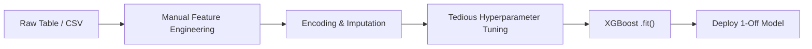
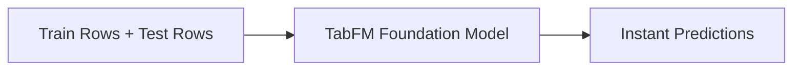

# Google's TabFM: Why Zero-Shot Foundation Models Are Changing Tabular ML Forever

Whenever people talk about the "AI Revolution," they usually show off Large Language Models writing poetry or image generators painting surreal sci-fi landscapes. But behind the scenes, away from the flashy demos, lies the **hidden titan of enterprise machine learning: Tabular Data.**

SQL tables, Excel spreadsheets, CSV files, customer activity logs, financial transactions, and medical records—tabular data powers over **80% of real-world enterprise ML applications**. It predicts whether a credit card transaction is fraudulent, whether a customer is about to cancel their subscription, or how much inventory a store should stock next week.


*Figure 1: TabFM brings zero-shot foundation model capabilities directly to tabular datasets. Image credit: Google Research.*

For over a decade, one class of algorithms has reigned supreme over tabular data: **Tree-based models like XGBoost, LightGBM, and Random Forests**.

However, Google Research recently released a landmark paper and model: **[TabFM](https://research.google/blog/introducing-tabfm-a-zero-shot-foundation-model-for-tabular-data/)**—a **zero-shot foundation model designed specifically for tabular data**.

TabFM signals a fundamental shift in how we build and deploy machine learning for structured data. In this post, we'll break down what TabFM is, walk through its architecture using Google's official diagrams, and explain why it represents a massive paradigm change for machine learning.

---

## The Old World: The "XGBoost Tax"

To understand why TabFM is a big deal, we first need to look at how data scientists currently build tabular ML models:



Imagine every time you wanted to bake a cake, you had to build a custom oven from raw metal, calibrate the temperature sensors by trial and error for 5 hours, bake the single cake, and then throw the oven away. 

That is effectively how tabular machine learning works today:
1. **Tedious Feature Engineering:** You spend days creating custom interaction columns, one-hot encoding categories, and handling missing numbers.
2. **Endless Hyperparameter Optimization:** You run grid searches or Bayesian optimization tuning tree depth, learning rates, subsample ratios, and regularization coefficients for hours.
3. **No Generalization Across Datasets:** An XGBoost model trained on customer churn for Company A cannot predict customer churn for Company B. You start from scratch for *every single dataset*.

Data scientists spend thousands of cumulative hours paying this "XGBoost Tax."

---

## Enter TabFM: In-Context Learning for Spreadsheets

In Natural Language Processing (NLP), Large Language Models (LLMs) solved this problem through **In-Context Learning (ICL)** and **Zero-Shot Learning**. You don't retrain GPT-4 or Gemini every time you ask a question; you simply pass your context and examples in the prompt, and the model predicts the answer in a **single forward pass** without updating any weights.

**TabFM brings this exact zero-shot foundation model magic to tabular data.**



With TabFM, you hand the model your historical table rows (with labels) alongside your unseen target rows (without labels) as a single unified prompt. TabFM analyzes the relationships, understands the pattern, and outputs accurate predictions instantly—**with zero model training, zero hyperparameter tuning, and zero manual feature engineering.**

---

## Under the Hood: Explaining the TabFM Architecture

Adapting LLMs to tables is notoriously tricky. Words in a sentence are **1D and ordered** (*"The cat sat on the mat"* changes meaning if you shuffle words). 

Tables, however, are **2D and orderless**:
* Swapping Row 10 and Row 20 doesn't change the dataset.
* Swapping Column A (`Age`) and Column B (`Income`) doesn't change what the data means.

To overcome this, Google synthesized the strengths of pioneering tabular models like TabPFN and TabICL into a novel hybrid design:


*Figure 2: The official TabFM architectural pipeline from Google Research. It alternates row and column attention, compresses row representations, and executes in-context learning.*

Let's break down this architecture step-by-step:

### Step 1: Alternating Row & Column Attention
As shown in the blue and orange blocks on the left of Figure 2, the raw input table is fed into a multi-layer attention module that alternates attention across:
* **Columns (Features):** By attending across columns, the model automatically discovers complex feature interactions (e.g., how `Income` interacts with `Credit Score`) without a data scientist having to manually multiply or encode columns.
* **Rows (Examples):** By attending across rows, it learns how historical training samples relate to one another and to the unseen test rows.

### Step 2: Row Compression
Following row-column contextualization, the rich multi-dimensional information for each individual row is compressed into a single, dense vector representation.

### Step 3: In-Context Learning (ICL) Transformer
Finally, a dedicated Transformer (shown on the right of Figure 2) operates over these compressed row vectors. Because it computes attention over compact row embeddings rather than the entire raw cell grid, the computation is lightning fast and scales efficiently to large enterprise tables!

---

## The Secret Sauce: Pre-Training on Hundreds of Millions of Synthetic Universes

Where did Google get the data to pre-train a Tabular Foundation Model?

In NLP, models pre-train on billions of public web pages. But enterprise tabular data is strictly proprietary, private, and scattered across secure corporate databases. There is no open-source "Common Crawl" for tabular datasets.

Google solved this with a clever approach: **TabFM is trained 100% on synthetic data generated using Structural Causal Models (SCMs).**

Google dynamically generated hundreds of millions of synthetic tables with mathematical functions simulating diverse real-world distributions, non-linear dependencies, noise, and complex causal structures. Because TabFM practiced on millions of simulated mathematical "universes," it learned universal tabular patterns that generalize effortlessly to real-world datasets it has never seen before.

---

## Benchmarks: Beating Tuned Models Out-of-the-Box

Google rigorously benchmarked TabFM on **TabArena**, a living leaderboard system evaluating head-to-head win rates (Elo scores) across 51 real-world datasets (38 classification and 13 regression tasks) ranging from 700 to 150,000 samples.


*Figure 3: Head-to-head TabArena Elo benchmarks comparing TabFM and TabFM-Ensemble against industry baselines. Image credit: Google Research.*

### Key Takeaways from the Results:
1. **TabFM (Pure Zero-Shot):** Generates predictions in a single forward pass with **zero tuning**, yet matches or exceeds heavily tuned, industry-standard tree algorithms.
2. **TabFM-Ensemble:** By combining cross-features, Singular Value Decomposition (SVD) representations, a 32-way ensemble, and Platt scaling calibration, TabFM-Ensemble achieves top-tier state-of-the-art performance on the leaderboard.

---

## The Big Paradigm Shift: Why TabFM Changes ML Forever

TabFM isn't just another incremental ML model; it represents a **paradigm change** in applied AI:

### 1. The End of "One Model Per Table"
Instead of maintaining thousands of custom XGBoost scripts, data pipelines, and model artifacts across an enterprise, organizations can deploy **one unified Tabular Foundation Model** that handles classification and regression across all departments instantly.

### 2. SQL Meets Instant Intelligence (`AI.PREDICT`)
Google is integrating TabFM directly into **Google BigQuery**. In the near future, engineers and business analysts won't need Python or ML libraries to build predictive models. They will run a simple SQL query:

```sql
SELECT customer_id, AI.PREDICT(model => 'tabfm', target => 'will_churn')
FROM enterprise_db.customers;
```

Zero Python, zero model training, zero deployment infrastructure. Accurate predictive ML natively executed inside database engines.

### 3. Real-Time Predictive AI
Because TabFM operates in a single forward pass, predictions can be generated in real-time within web applications, microservices, or Edge devices without offline batch training schedules.

---

## Summary

For over a decade, tabular ML was locked in the era of manual feature crafting and hyperparameter tuning. Google's **TabFM** proves that foundation models and in-context learning aren't just for chat tools or art generators—they are coming for structured enterprise data.

By eliminating the tedious training lifecycle and bringing zero-shot inference to spreadsheets and SQL databases, TabFM marks the beginning of a new era where tabular prediction is as simple, fast, and accessible as asking an LLM a question.
