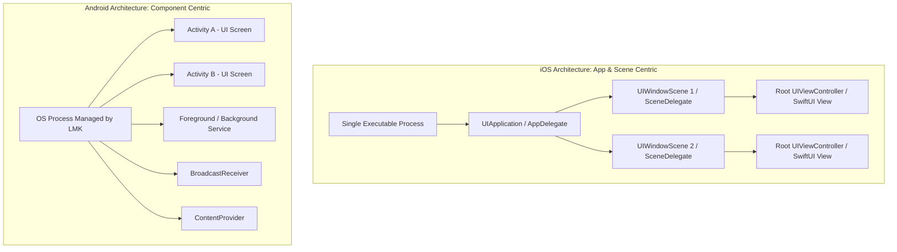
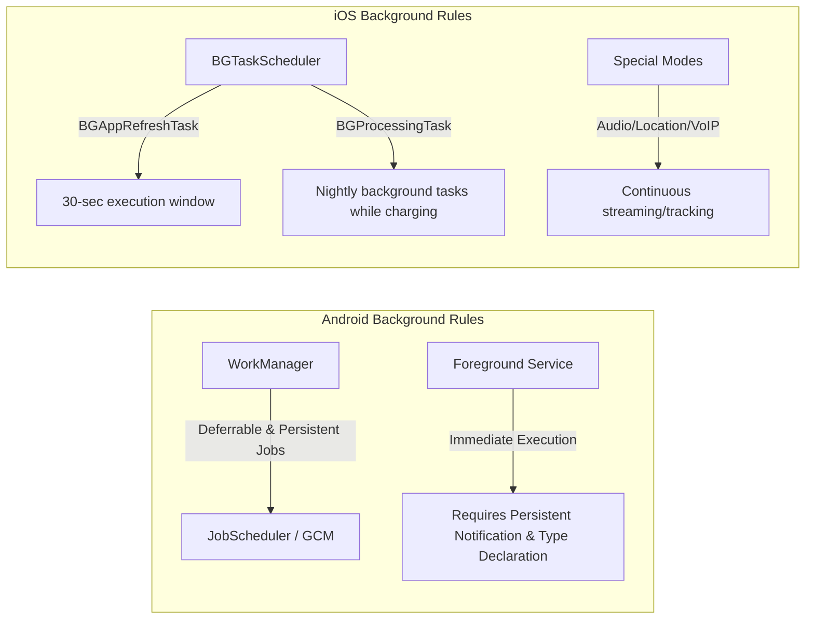

# iOS App Lifecycle vs. Android App Lifecycle: The Ultimate Architectural Guide & Bug-Fixing Playbook

Ask any seasoned mobile engineer about their hardest production bugs, and odds are high they won't talk about complex math or syntax errors. Instead, they will describe mysterious crashes that only happen to users in the wild:
*   A `NullPointerException` when a user opens the app after receiving a phone call.
*   An iOS app instantly force-closed by the OS with the cryptic error code `0x8badf00d`.
*   A user losing all form data when they rotate their screen.
*   Background battery drain that causes app store reviewers to reject the release.

The root cause behind **over 80% of these production bugs** comes down to one fundamental domain: **misunderstanding how the iOS and Android operating systems manage application lifecycles and process lifetimes**.

In this comprehensive guide, we will unpack the architectural differences, state transitions, low-memory mechanisms, background rules, and state restoration mechanics across both platforms—concluding with a practical **Bug-Fixing Playbook** to help you debug and prevent lifecycle defects once and for all.

---

## 1. Core Architectural Philosophies: App-Centric vs. Component-Centric

To understand lifecycle callbacks, you must first understand how each operating system views your application.



### iOS: App & Scene-Centric Model
iOS treats your app as a single monolithic process bound tightly to visual window instances (**Scenes**). 
*   Prior to iOS 13, `UIApplicationDelegate` managed both process life and UI life.
*   From iOS 13+ (and SwiftUI), the responsibility is split:
    *   **Process Lifecycle (`AppDelegate`):** Manages process launch, push notification registration, background task registration, and process termination notifications.
    *   **UI/Scene Lifecycle (`SceneDelegate` or SwiftUI `ScenePhase`):** Manages multiple window instances, visibility, input focus, and backgrounding per scene.

### Android: Component-Centric Model
Android does **not** view your application as a single monolithic UI entry point. Instead, an app is a collection of decoupled **Components**:
1.  **Activities:** UI screens.
2.  **Services:** Background or foreground execution tasks.
3.  **BroadcastReceivers:** Event listeners for system or app signals.
4.  **ContentProviders:** Data sharing interfaces.

Crucially, **the Android OS Process Lifecycle is decoupled from the Activity Lifecycle**. Android can launch a process to run a `BroadcastReceiver` or `Service` without EVER instantiating an `Activity`. Furthermore, the OS can kill an `Activity` while keeping the process alive, or kill the entire process while preserving state bundles to restore the `Activity` later.

---

## 2. Phase-by-Phase Lifecycle State Comparison

Let's look at how lifecycle states map between iOS (UIKit/SwiftUI) and Android (Activity/LifecycleOwner).

| State Phase | Android Activity Lifecycle | iOS Scene Lifecycle (UIKit / SwiftUI) | Operating System Behavior & Purpose |
| :--- | :--- | :--- | :--- |
| **Not Running** | Activity not instantiated / Process dead | `.unattached` / Not Running | App is dormant in storage; no memory allocated. |
| **Initializing / Creation** | `onCreate()` | `willFinishLaunching` / `willConnectTo` | Allocate memory, initialize view components, inject dependencies. |
| **Visible / Inactive** | `onStart()` | `.inactive` (`sceneWillResignActive`) | UI is visible on screen, but does **not** have input focus (e.g., system overlay, incoming call banner, app switcher view). |
| **Active / Focused** | `onResume()` | `.active` (`sceneDidBecomeActive`) | App is in foreground, fully interactive, animations running at target FPS. |
| **Pausing / Losing Focus** | `onPause()` | `.inactive` (`sceneWillResignActive`) | User is navigating away or overlay presented. Pause high-frequency tasks, sensors, or video playback. |
| **Background / Stopped** | `onStop()` | `.background` (`sceneDidEnterBackground`) | App is off-screen. Save unsaved data, release heavy graphics/cache resources, pause timers. |
| **Destroyed / Killed** | `onDestroy()` | Terminated / Unattached | Component or scene is torn down. **Note:** Not guaranteed to run on OS process kill! |

---

### Detailed Code Callback Comparison

#### Android Activity & Fragment Callbacks (Kotlin)
```kotlin
class MainActivity : AppCompatActivity() {

    override fun onCreate(savedInstanceState: Bundle?) {
        super.onCreate(savedInstanceState)
        // 1. Initialize UI, setup ViewModels, restore savedInstanceState
        setContentView(R.layout.activity_main)
    }

    override fun onStart() {
        super.onStart()
        // 2. UI becomes visible to user. Register UI observers.
    }

    override fun onResume() {
        super.onResume()
        // 3. User focus gained. Start camera preview, location polling, interactive animations.
    }

    override fun onPause() {
        // 4. Focus lost (e.g., multi-window mode, dialog popup, user leaving).
        // Release camera, pause audio/video immediately.
        super.onPause()
    }

    override fun onStop() {
        // 5. App no longer visible. Save draft data to database, release heavy resources.
        super.onStop()
    }

    override fun onDestroy() {
        // 6. Final cleanup. WARNING: OS will skip this if process is killed in background!
        super.onDestroy()
    }
}
```

#### iOS SceneDelegate & SwiftUI Callbacks (Swift)
```swift
// Modern UIKit SceneDelegate
class SceneDelegate: UIResponder, UIWindowSceneDelegate {
    var window: UIWindow?

    func scene(_ scene: UIScene, willConnectTo session: UISceneSession, options connectionOptions: UIScene.ConnectionOptions) {
        // 1. Scene created and attached to window. Setup root view controller.
    }

    func sceneWillEnterForeground(_ scene: UIScene) {
        // 2. Transitioning from background to foreground. Prepare UI elements.
    }

    func sceneDidBecomeActive(_ scene: UIScene) {
        // 3. App gained input focus. Resume animations, timers, camera feeds.
    }

    func sceneWillResignActive(_ scene: UIScene) {
        // 4. Input focus losing (App Switcher open, phone call incoming). Pause ongoing tasks.
    }

    func sceneDidEnterBackground(_ scene: UIScene) {
        // 5. Scene moved off-screen. Save state, release shared memory, request background task time if needed.
    }

    func sceneDidDisconnect(_ scene: UIScene) {
        // 6. Scene released by system (e.g., user swiped away scene in app switcher).
    }
}
```

In modern **SwiftUI**, this state tracking is declared cleanly using `@Environment(\.scenePhase)`:

```swift
import SwiftUI

@main
struct LifeCycleApp: App {
    @Environment(\.scenePhase) private var scenePhase

    var body: some Scene {
        WindowGroup {
            ContentView()
        }
        .onChange(of: scenePhase) { oldPhase, newPhase in
            switch newPhase {
            case .active:
                print("App is active and focused")
            case .inactive:
                print("App is inactive (losing focus or in transition)")
            case .background:
                print("App entered background - save state & pause operations")
            @unknown default:
                break
            }
        }
    }
}
```

---

## 3. Under the Hood: Low Memory Killers & OS Process Termination

Understanding what happens when memory runs low is where true mobile architecture expertise shines.

```mermaid
flowchart TD
    subgraph Android Low Memory Killer (LMK)
        A1[System Memory Low] --> A2{Check oom_adj Score}
        A2 -->|Highest Score: Cached/Background Apps| A3[SIGKILL Process without calling onDestroy]
        A2 -->|Medium Score: Services| A4[Kill Service if RAM critical]
        A2 -->|Lowest Score: Foreground App| A5[Keep Alive / Trigger TRIM_MEMORY_COMPLETE]
    end

    subgraph iOS Jetsam & Memory Pressure
        I1[System Memory Low] --> I2[Dispatch didReceiveMemoryWarning]
        I2 --> I3{App reduces RAM?}
        I3 -->|No / Still High| I4[Jetsam sends SIGKILL process instantly]
        I3 -->|Yes| I5[App continues execution in background freeze]
    end
```

### Android: Low Memory Killer (LMK) & `oom_adj`
Android assigns an **Out-Of-Memory score (`oom_adj`)** to every running process based on its current component states:
1.  **Foreground Process (`oom_adj` = 0):** Running an active `Activity`, running `onResume()`, or executing a `ForegroundService` with notification.
2.  **Visible Process:** Activity visible (`onStart()`), but not focused (e.g., covered by transparent dialog).
3.  **Service Process:** Running an active background Service.
4.  **Cached / Background Process:** All Activities are stopped (`onStop()`). Placed in an LRU (Least Recently Used) cache list.

> **CRITICAL Android Rule:** When RAM is low, the LMK issues a kernel `SIGKILL` directly to Cached Background processes. **`onDestroy()` is NOT called.** Your process is vaporized from RAM instantly.

### iOS: Jetsam, Memory Pressure & Watchdog Timers
iOS uses a kernel daemon called **Jetsam** to enforce strict memory bounds.

1.  **Memory Warnings:** When system memory drops, iOS sends `didReceiveMemoryWarning` to `UIViewController`s and broadcasts `UIApplication.didReceiveMemoryWarningNotification`.
2.  **Jetsam SIGKILL:** If an app ignores warnings or exceeds its hard memory limit (especially in background), Jetsam terminates the app with no graceful shutdown callbacks.
3.  **The Watchdog Timer (Fatal Code `0x8badf00d` - "Ate Bad Food"):** iOS monitors app responsiveness during lifecycle state transitions. If your app blocks the main thread during launch, backgrounding, or resume for longer than allowed (~5-20 seconds depending on state), the iOS Watchdog kills the process immediately with exception code `0x8badf00d`.

---

## 4. State Restoration: Surviving Process Death

Because both operating systems aggressively kill background processes to free RAM, mobile developers must build apps to survive **Process Re-creation**.

### Android State Restoration Strategy
When Android kills a background process, it retains the Activity's **Saved State Bundle**. When the user re-opens the app from Recents, Android spawns a **brand-new process** and passes the saved bundle into `onCreate(savedInstanceState: Bundle?)`.

```kotlin
// ViewModel State Preservation via SavedStateHandle
class UserProfileViewModel(
    private val savedStateHandle: SavedStateHandle
) : ViewModel() {

    // Automatically persisted across process death!
    var userId: String?
        get() = savedStateHandle["USER_ID"]
        set(value) { savedStateHandle["USER_ID"] = value }
}
```

### iOS State Restoration Strategy
iOS supports state restoration via `NSUserActivity`, `UIStateRestoring`, or SwiftUI's `@SceneStorage`:

```swift
struct FormView: View {
    // Automatically saved and restored by iOS if the scene process is recreated
    @SceneStorage("user_draft_text") private var draftText: String = ""

    var body: some View {
        TextEditor(text: $draftText)
    }
}
```

---

## 5. Background Execution Rules & Constraints

Both operating systems severely restrict background work to preserve user battery life and memory.



*   **Android (Android 8.0+ to 14+):**
    *   Plain background `Service` calls are prohibited when app is in background (`IllegalStateException`).
    *   Must use **WorkManager** for deferrable background sync.
    *   Must use **Foreground Services** (with explicit service type declaration in Android 14+) for immediate tasks, displaying an ongoing visible system notification.
*   **iOS:**
    *   No free-form background execution.
    *   Apps get ~30 seconds of background time in `sceneDidEnterBackground(_:)` by requesting `beginBackgroundTask`.
    *   Scheduled tasks must register with `BGTaskScheduler` (`BGAppRefreshTask` or `BGProcessingTask`).
    *   Long-running background tasks require hardware-backed entitlement capabilities (Audio, Location Updates, Voice over IP).

---

## 6. The Bug-Fixing Playbook: 6 Common Lifecycle Bugs & Exact Fixes

Now let's apply this knowledge to solve the most prevalent production bugs in mobile development.

---

### Bug 1: Unhandled Process Death & Singleton Crash (Android)

#### Symptom:
A crash occurs with `NullPointerException` when a user returns to your Android app after leaving it in the background for 20 minutes:
`java.lang.NullPointerException: Attempt to invoke virtual method on a null object reference`

#### Root Cause:
Developers often store session tokens, user models, or global managers inside static variables or singletons (`UserSession.currentUser`). 

When the app goes to the background, Android's LMK kills the process. When the user taps the app icon in Recents, Android recreates `MainActivity` directly with `onCreate(savedInstanceState != null)`. However, **all static variables and singletons are re-initialized to `null`!**

```kotlin
// ❌ WRONG: Assuming static singleton state survives process death
class UserSession {
    companion object {
        var currentUser: User? = null // Reset to NULL on process recreation!
    }
}

class ProfileActivity : AppCompatActivity() {
    override fun onCreate(savedInstanceState: Bundle?) {
        super.onCreate(savedInstanceState)
        // CRASH: currentUser is null if process was killed!
        val name = UserSession.currentUser!!.name
    }
}
```

#### Fix:
Never rely on transient memory / singletons to survive backgrounding. Always persist essential session state into disk (`DataStore`, `SharedPreferences`, encrypted database) or store identifiers in `SavedStateHandle`:

```kotlin
// ✅ CORRECT: Load from persistent repository or restore via ViewModel
class ProfileViewModel(
    private val savedStateHandle: SavedStateHandle,
    private val userRepository: UserRepository
) : ViewModel() {

    val userId: String = savedStateHandle["USER_ID"] 
        ?: userRepository.getSavedUserId() 
        ?: throw IllegalStateException("Session expired")
}
```

---

### Bug 2: The iOS Watchdog Termination (`0x8badf00d`)

#### Symptom:
iOS app crashes immediately on launch or backgrounding for some users, generating a crash log containing:
`Exception Type: EXC_CRASH (SIGKILL)`
`Termination Reason: SIGNAL 9 Resource limit [CODES], Exception Subtype: KILLED BY HANDSHAKE / WATCHDOG (0x8badf00d)`

#### Root Cause:
Performing heavy synchronous work on the Main Thread inside `application(_:didFinishLaunchingWithOptions:)` or `sceneDidEnterBackground(_:)`. For example: running database migrations, synchronous HTTP requests, or large image decodes on `DispatchQueue.main`.

```swift
// ❌ WRONG: Blocking main thread during app launch
func application(_ application: UIApplication, didFinishLaunchingWithOptions launchOptions: [UIApplication.LaunchOptionsKey: Any]?) -> Bool {
    // Synchronous database migration taking 6 seconds on older devices!
    DatabaseManager.shared.migrateDatabaseSynchronously() 
    return true
}
```

#### Fix:
Keep launch callbacks under **100 milliseconds**. Offload heavy setup tasks to background queues:

```swift
// ✅ CORRECT: Asynchronous initialization off the main thread
func application(_ application: UIApplication, didFinishLaunchingWithOptions launchOptions: [UIApplication.LaunchOptionsKey: Any]?) -> Bool {
    DispatchQueue.global(qos: .userInitiated).async {
        DatabaseManager.shared.migrateDatabaseSynchronously()
    }
    return true
}
```

---

### Bug 3: Activity/Fragment Memory Leaks on Screen Rotation (Android)

#### Symptom:
App memory usage continuously climbs every time the user rotates their screen or navigates between screens, eventually resulting in `OutOfMemoryError` (OOM).

#### Root Cause:
Android destroys and recreates the `Activity` instance on screen rotation (configuration change). If a long-lived object (Singleton, Location Manager, Static reference, or Async task) holds a reference to the old Activity's `Context`, that entire Activity and its entire View hierarchy is leaked in RAM.

```kotlin
// ❌ WRONG: Passing Activity Context to long-lived Singleton
class LocationTracker(private val context: Context) {
    fun startTracking() { /* ... */ }
}

class MapActivity : AppCompatActivity() {
    override fun onCreate(savedInstanceState: Bundle?) {
        super.onCreate(savedInstanceState)
        // LEAK: Passing 'this' (Activity context) to a Singleton retains old Activity forever!
        LocationTrackerManager.getInstance(this).startTracking()
    }
}
```

#### Fix:
Use `applicationContext` for long-lived components, and unbind listeners inside lifecycle-aware wrappers (`DefaultLifecycleObserver`):

```kotlin
// ✅ CORRECT: Use Application Context & LifecycleObserver
class LocationTracker(private val context: Context) : DefaultLifecycleObserver {
    private val appContext = context.applicationContext // Safe from leaks!

    override fun onStart(owner: LifecycleOwner) {
        // Start listening when UI is visible
    }

    override fun onStop(owner: LifecycleOwner) {
        // Stop listening when UI is hidden
    }
}
```

---

### Bug 4: Strong Reference Cycle & Closure Leaks in ViewControllers (iOS)

#### Symptom:
`UIViewController` or ViewModel `deinit` is never called when the user dismisses a screen, leaving network listeners and timers active in the background.

#### Root Cause:
Capturing `self` strongly inside an asynchronous closure or callback closure without a `[weak self]` capture list.

```swift
// ❌ WRONG: Strong reference cycle prevents deallocation
class NewsViewController: UIViewController {
    var timer: Timer?

    override func viewDidLoad() {
        super.viewDidLoad()
        timer = Timer.scheduledTimer(withTimeInterval: 1.0, repeats: true) { _ in
            self.updateUI() // Strong reference to 'self' inside timer closure!
        }
    }
}
```

#### Fix:
Use `[weak self]` or `[unowned self]` in closures, and invalidate timers on lifecycle teardown or view disappearance:

```swift
// ✅ CORRECT: Weak capture list and clean teardown
class NewsViewController: UIViewController {
    var timer: Timer?

    override func viewDidLoad() {
        super.viewDidLoad()
        timer = Timer.scheduledTimer(withTimeInterval: 1.0, repeats: true) { [weak self] _ in
            guard let self = self else { return }
            self.updateUI()
        }
    }

    override func viewWillDisappear(_ animated: Bool) {
        super.viewWillDisappear(animated)
        timer?.invalidate()
        timer = null
    }

    deinit {
        print("NewsViewController cleanly deallocated from RAM!")
    }
}
```

---

### Bug 5: Background Battery Drain & Unstopped Sensors

#### Symptom:
App burns 20%+ battery per hour even while resting in the user's pocket.

#### Root Cause:
Starting sensors (GPS location updates, accelerometer, camera feeds, Bluetooth scanning, audio recording) in `onCreate()` or `viewDidLoad()`, but failing to stop them when the app transitions to `onStop()` / `sceneDidEnterBackground`.

#### Fix:
Mirror your resource allocations across lifecycle callbacks:

```
Allocate in onStart()  <--->  Release in onStop()     (Android)
Allocate in onResume() <--->  Release in onPause()    (Android)
Allocate in active     <--->  Release in background (iOS)
```

```kotlin
// ✅ CORRECT: Android Lifecycle-Aware Sensor Control
class CameraPreviewManager(private val lifecycle: Lifecycle) : DefaultLifecycleObserver {
    init {
        lifecycle.addObserver(this)
    }

    override fun onResume(owner: LifecycleOwner) {
        startCameraHardware() // Start only when focused
    }

    override fun onPause(owner: LifecycleOwner) {
        stopCameraHardware() // Stop immediately when focus lost
    }
}
```

---

### Bug 6: Stale UI & Form State Not Updating on Resume

#### Symptom:
User edits profile data in a web browser or another device, switches back to the mobile app, but the screen still shows old cached data until the user force-closes and re-opens the app.

#### Root Cause:
Fetching or observing data **only inside `onCreate()` (Android) or `viewDidLoad()` (iOS)**. These callbacks fire **ONLY ONCE** when the view is created in memory. They do **NOT** re-trigger when the app returns from background to foreground!

#### Fix:
Place transient UI refresh logic in `onResume()` / `repeatOnLifecycle(Lifecycle.State.STARTED)` on Android, and `sceneDidBecomeActive` or `.onReceive(NotificationCenter.default.publisher(for: UIApplication.didBecomeActiveNotification))` on iOS / SwiftUI.

```swift
// ✅ CORRECT: SwiftUI Refreshing Data on Foreground Re-entry
struct DashboardView: View {
    @StateObject private var viewModel = DashboardViewModel()

    var body: some View {
        VStack {
            Text("Balance: \(viewModel.balance)")
        }
        .onReceive(NotificationCenter.default.publisher(for: UIApplication.didBecomeActiveNotification)) { _ in
            viewModel.refreshAccountData()
        }
    }
}
```

---

## 7. Summary Cheat Sheet: The Master Rules of Mobile Lifecycle

To build crash-resilient mobile applications across both platforms, follow these universal rules:

1.  **Never Store Session Data Purely in Memory:** Singletons and static variables will be reset to `null` during Android LMK kills or iOS process terminations. Use `SavedStateHandle`, `@SceneStorage`, or persistent storage.
2.  **Respect Main Thread Execution Budgets:** Keep launch logic under 100ms. Never perform synchronous DB/Network work inside app launch or background entry callbacks, or risk iOS Watchdog (`0x8badf00d`) terminations.
3.  **Always Mirror Resource Registration:** If you register a listener/sensor in `onStart()` / `viewWillAppear()`, unregister it in `onStop()` / `viewWillDisappear()`.
4.  **Use Lifecycle-Aware Coroutine Scopes / Combine Pipelines:** Use Android's `repeatOnLifecycle` or Swift's `@Environment(\.scenePhase)` to automatically suspend background flow emissions when UI is hidden.
5.  **Test Process Death in Development:**
    *   **Android:** Enable *Settings -> Developer Options -> Don't keep activities*, or run `adb shell am kill <package-name>`.
    *   **iOS:** In Xcode, stop the debugger while app is in background, or test memory warnings via *Debug -> Simulate Memory Warning*.

Mastering these lifecycle nuances transforms mobile developers from reactive bug-fixers into proactive software architects.
